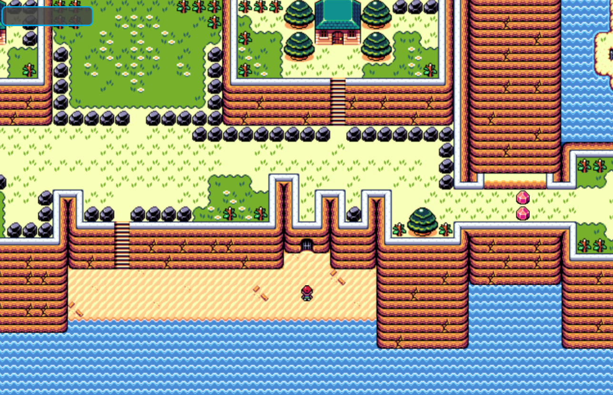
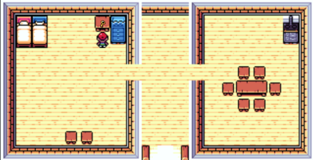
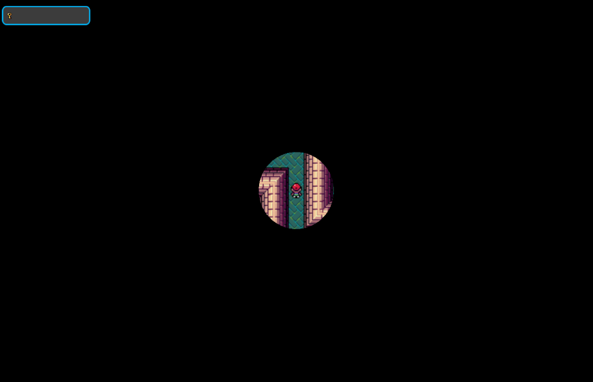
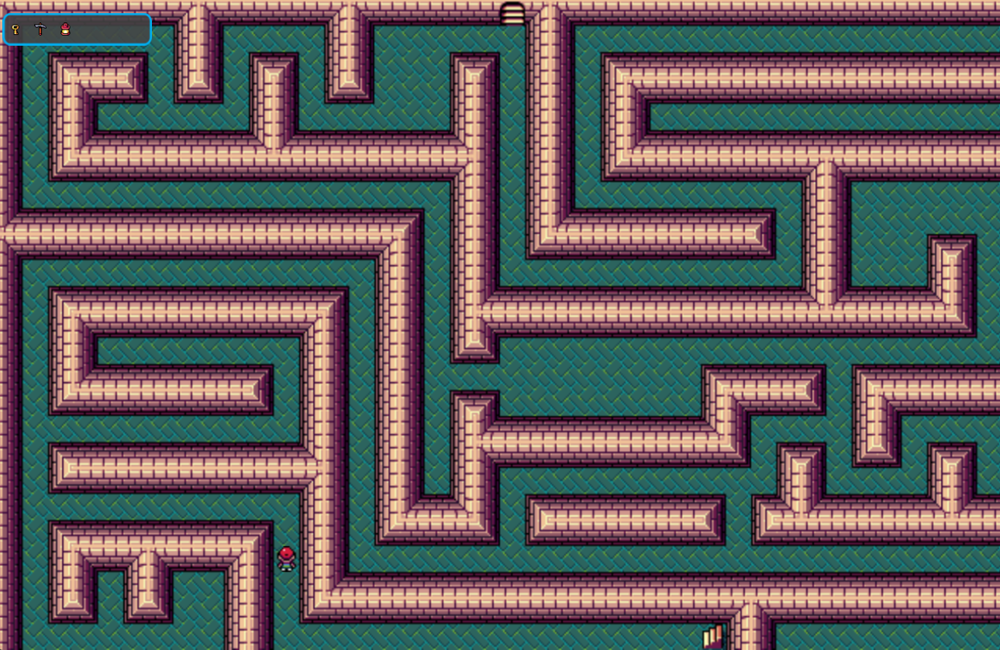

# 🧭 Top-Down Game (C#)

A 2D top-down game developed in C#, focused on intelligent character navigation, interactive scenes.

## 🎮 Key Features

- **Character Movement Using A-star Algorithm**  
  The player moves through the game world using a custom A* pathfinding system, enabling smart and obstacle-aware navigation.

- **Tilemap-Based World Design with Tiled**  
  The game world is built using [Tiled](https://www.mapeditor.org/), a flexible tilemap editor. TMX maps are parsed and rendered in-game to create modular and efficient level layouts.

- **Multi-Scene Environment**  
  The game is composed of several scenes, each with interactive elements and collectible objects.

- **Dynamic Visibility System**  
  A cave area is initially obscured by a post-processing effect to simulate darkness. When the player collects a torch, the effect is removed and visibility is restored.

## 🧱 Technologies & Systems

- **C#**
- **A-star Pathfinding Algorithm**
- **Tiled Map Editor (.tmx integration)**
- **Tilemap Rendering**
- **2D Scene Management**
- **Post-Processing Effects**
- **Item Collection Mechanics**

## 🎯 Goals & Learning Objectives

- Design a modular architecture for a 2D adventure game  
- Implement custom pathfinding and interaction systems  
- Use Tiled for efficient world building and level design  
- Explore environmental storytelling through lighting and effects

## 🚀 Getting Started

1. Clone this repository  
2. Open the project in your preferred C# development environment  
3. Make sure TMX maps are correctly referenced in the project  
4. Compile and run the game  
5. Explore scenes, collect items, and test the dynamic cave mechanic

## 📸 Screenshots

### 🧭 Overworld Scene

### 🏠 Inside a House

### 🔦 Dark Cave (Before Collecting Torch)

### 🔥 Cave with Torch (Post-Processing Removed)

